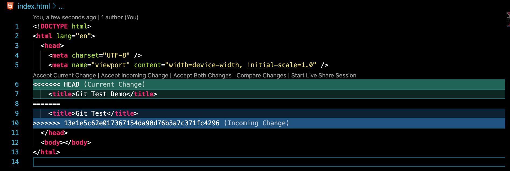

# git-test-readme

Cloning of repository

```
~/Documents/Development                                ✔  3296  19:06:24
$  git clone git@github.com:carl-vega/git-test.git
Cloning into 'git-test'...
remote: Enumerating objects: 3, done.
remote: Counting objects: 100% (3/3), done.
remote: Total 3 (delta 0), reused 0 (delta 0), pack-reused 0
Receiving objects: 100% (3/3), done.
```

Navigating into repository

```
 ~/Documents/Development                                ✔  3297  19:06:39
 $ cd git-test
```

Entering `git status` command shows the branch `master` on the default name origin

```
 ~/Documents/Development/git-test   master              ✔  3297  19:06:49
 $ git status
On branch master
Your branch is up to date with 'origin/master'.

nothing to commit, working tree clean
```

```
 ~/Documents/Development/git-test   master              ✔  3298  19:07:12
 $  git remote -v
origin	git@github.com:carl-vega/git-test.git (fetch)
origin	git@github.com:carl-vega/git-test.git (push)
```

Creating a branch named `new-branch`

```
 ~/Documents/Development/git-test   master              ✔  3299  19:08:04
 $ git checkout -b new-branch
Switched to a new branch 'new-branch'
```

The branch also has the same remote with the default name origin

```
 ~/Documents/Development/git-test   new-branch          ✔  3299  19:08:51
 $ git remote -v
origin	git@github.com:carl-vega/git-test.git (fetch)
origin	git@github.com:carl-vega/git-test.git (push)
```

```
 ~/Documents/Development/git-test   new-branch          ✔  3300  19:09:04
 $ git status
On branch new-branch
nothing to commit, working tree clean
```

```
 ~/Documents/Development/git-test   new-branch          ✔  3301  19:09:38
 $ git checkout master
Switched to branch 'master'
Your branch is up to date with 'origin/master'.
```

Creating a branch named `another-branch`

```
 ~/Documents/Development/git-test   master              ✔  3302  19:10:43
 $ git checkout -b another-branch
Switched to a new branch 'another-branch'
```

Creating a HTML file in the branch `another-branch`

```
 ~/Documents/Development/git-test   another-branch      ✔  3303  19:11:19
 $ touch index.html
```

Staging,or adding, and commiting changes to branch to be pushed

```
 ~/Documents/Development/git-test   another-branch ?    ✔  3304  19:11:41
 $ git add .
```

```
 ~/Documents/Development/git-test   another-branch ✚    ✔  3305  19:11:49
 $ git commit -m "added index.html"
[another-branch 5f09a50] added index.html
 1 file changed, 0 insertions(+), 0 deletions(-)
 create mode 100644 index.html
```

Unable to push changes due to a lack of an upstream branch

```
 ~/Documents/Development/git-test   another-branch      ✔  3306  19:12:16
 $ git push
fatal: The current branch another-branch has no upstream branch.
To push the current branch and set the remote as upstream, use

    git push --set-upstream origin another-branch

```

Following the given command I was able to set the upstream branch and push staged changes

```
 ~/Documents/Development/git-test   another-branch  128 ↵  3307  19:12:33
 $ git push --set-upstream origin another-branch
Enumerating objects: 4, done.
Counting objects: 100% (4/4), done.
Delta compression using up to 8 threads
Compressing objects: 100% (2/2), done.
Writing objects: 100% (3/3), 283 bytes | 283.00 KiB/s, done.
Total 3 (delta 0), reused 0 (delta 0)
remote:
remote: Create a pull request for 'another-branch' on GitHub by visiting:
remote:      https://github.com/carl-vega/git-test/pull/new/another-branch
remote:
To github.com:carl-vega/git-test.git
 * [new branch]      another-branch -> another-branch
Branch 'another-branch' set up to track remote branch 'another-branch' from 'origin'.
```

Nothing changes with the remote status

```
 ~/Documents/Development/git-test   another-branch      ✔  3308  19:13:15
 $ git remote -v
origin	git@github.com:carl-vega/git-test.git (fetch)
origin	git@github.com:carl-vega/git-test.git (push)
```

But now there is an upstream branch `origin/another-branch`

```
 ~/Documents/Development/git-test   another-branch      ✔  3309  19:13:25
 $ git status
On branch another-branch
Your branch is up to date with 'origin/another-branch'.

nothing to commit, working tree clean
```

Switching back to master branch nothing has changed

```
 ~/Documents/Development/git-test   another-branch      ✔  3310  19:13:51
 $ git checkout master
Switched to branch 'master'
Your branch is up to date with 'origin/master'.
```

```
 ~/Documents/Development/git-test   master              ✔  3311  19:15:28
 $ git status
On branch master
Your branch is up to date with 'origin/master'.

nothing to commit, working tree clean
```

Cannot pull due to not creating a pull request and merging changes

```
 ~/Documents/Development/git-test   master              ✔  3312  19:15:38
 $ git pull
Already up to date.
```

Created a pull request, merged changes, and did the pull request

```
 ~/Documents/Development/git-test   master              ✔  3313  19:15:49
 $ git pull
remote: Enumerating objects: 1, done.
remote: Counting objects: 100% (1/1), done.
remote: Total 1 (delta 0), reused 0 (delta 0), pack-reused 0
Unpacking objects: 100% (1/1), done.
From github.com:carl-vega/git-test
   aa64e70..8c8736a  master     -> origin/master
Updating aa64e70..8c8736a
Fast-forward
 index.html | 0
 1 file changed, 0 insertions(+), 0 deletions(-)
 create mode 100644 index.html
```

```
 ~/Documents/Development/git-test   master              ✔  3313  19:17:49
 $ git status
On branch master
Your branch is up to date with 'origin/master'.

nothing to commit, working tree clean
```

```
 ~/Documents/Development/git-test   master              ✔  3314  19:18:10
 $ git remote -v
origin	git@github.com:carl-vega/git-test.git (fetch)
origin	git@github.com:carl-vega/git-test.git (push)
```

Switched back to first branch `new-branch`

```
 ~/Documents/Development/git-test   master              ✔  3317  19:21:02
 $ git checkout new-branch
Switched to branch 'new-branch'
```

```
 ~/Documents/Development/git-test   new-branch          ✔  3318  19:21:21
 $ touch script.js
```

```
 ~/Documents/Development/git-test   new-branch ?        ✔  3319  19:22:17
 $ git add .
```

```
 ~/Documents/Development/git-test   new-branch ✚        ✔  3320  19:22:21
 $ git commit -m "added script.js"
[new-branch 073e908] added script.js
 1 file changed, 0 insertions(+), 0 deletions(-)
 create mode 100644 script.js
```

```
 ~/Documents/Development/git-test   new-branch          ✔  3321  19:22:41
 $ git push
fatal: The current branch new-branch has no upstream branch.
To push the current branch and set the remote as upstream, use

    git push --set-upstream origin new-branch

```

Duplicated the same process for the branch `new-branch`

```
 ~/Documents/Development/git-test   new-branch      128 ↵  3322  19:22:49
 $ git push --set-upstream origin new-branch
Enumerating objects: 4, done.
Counting objects: 100% (4/4), done.
Delta compression using up to 8 threads
Compressing objects: 100% (2/2), done.
Writing objects: 100% (3/3), 281 bytes | 281.00 KiB/s, done.
Total 3 (delta 0), reused 0 (delta 0)
remote:
remote: Create a pull request for 'new-branch' on GitHub by visiting:
remote:      https://github.com/carl-vega/git-test/pull/new/new-branch
remote:
To github.com:carl-vega/git-test.git
 * [new branch]      new-branch -> new-branch
Branch 'new-branch' set up to track remote branch 'new-branch' from 'origin'.
```

Pull request, and `git pull` command

```
 ~/Documents/Development/git-test   new-branch          ✔  3323  19:23:04
 $ git pull
remote: Enumerating objects: 4, done.
remote: Counting objects: 100% (4/4), done.
remote: Compressing objects: 100% (2/2), done.
remote: Total 2 (delta 0), reused 0 (delta 0), pack-reused 0
Unpacking objects: 100% (2/2), done.
From github.com:carl-vega/git-test
   8c8736a..e214cfa  master     -> origin/master
Already up to date.
```

Switch branch back to master

```
 ~/Documents/Development/git-test   new-branch          ✔  3324  19:24:01
 $ git checkout master
Switched to branch 'master'
Your branch is behind 'origin/master' by 2 commits, and can be fast-forwarded.
  (use "git pull" to update your local branch)
```

Git pull to update branch `master`

```
 ~/Documents/Development/git-test   master ↓2           ✔  3325  19:24:29
 $ git pull
Updating 8c8736a..e214cfa
Fast-forward
 script.js | 0
 1 file changed, 0 insertions(+), 0 deletions(-)
 create mode 100644 script.js
```

Switching back to branch `new-branch`

```
 ~/Documents/Development/git-test   master              ✔  3326  19:24:37
 $ git checkout new-branch
Switched to branch 'new-branch'
Your branch is up to date with 'origin/new-branch'.
```

Git pull showing branch up to date, but it is not

```
 ~/Documents/Development/git-test   new-branch          ✔  3327  19:25:16
 $ git pull
Already up to date.
```

Command `git fetch origin` will fetch from origin

```
 ~/Documents/Development/git-test   new-branch          ✔  3328  19:25:25
 $ git fetch origin
```

```
 ~/Documents/Development/git-test   new-branch          ✔  3329  19:28:09
 $ git status
On branch new-branch
Your branch is up to date with 'origin/new-branch'.

nothing to commit, working tree clean
commit e214cfa07b5a89893c9319f714cd79fddd9b9013 (HEAD -> new-branch, origin/master, origin/HEAD, master)
Merge: 8c8736a 073e908
Author: Carl Vega <36179717+carl-vega@users.noreply.github.com>
Date:   Mon Jun 29 19:23:25 2020 -0400

    Merge pull request #2 from carl-vega/new-branch

    added script.js

commit 073e908326333b8f11ce4acd97a14a07f33d69f1 (origin/new-branch)
Author: Carl Vega <carljasonvega@gmail.com>
Date:   Mon Jun 29 19:22:41 2020 -0400
```

Now command `git merge origin/master` does a merge to current branch of the local copy of the remote branch `origin/master`

```
 ~/Documents/Development/git-test   new-branch          ✔  3330  19:28:28
 $ git merge origin/master
Updating 073e908..e214cfa
Fast-forward
 index.html | 0
 1 file changed, 0 insertions(+), 0 deletions(-)
 create mode 100644 index.html
```

A `git pull origin/master` is the combined verion of `git fetch` and `git merge`

The files are all available in the current branch

```
 ~/Documents/Development/git-test   new-branch ↑3       ✔  3331  19:28:51
 $ ls
README.md  index.html script.js
```

```
 ~/Documents/Development/git-test   new-branch ↑3       ✔  3332  19:45:26
 $ git remote
origin
```

Still nothing has changed with the remote repository

```
 ~/Documents/Development/git-test   new-branch ↑3       ✔  3333  19:46:26
 $ git remote -v
origin	git@github.com:carl-vega/git-test.git (fetch)
origin	git@github.com:carl-vega/git-test.git (push)
```

Now to create a merge problem
This snippet was added to branch `new-branch` , staged, commited, and pushed

```
<!DOCTYPE html>
<html lang="en">
  <head>
    <meta charset="UTF-8" />
    <meta name="viewport" content="width=device-width, initial-scale=1.0" />
    <title>Git Test</title>
  </head>
  <body></body>
</html>

```

This snippet was added to branch `master` , staged, and commited

```
<!DOCTYPE html>
<html lang="en">
  <head>
    <meta charset="UTF-8" />
    <meta name="viewport" content="width=device-width, initial-scale=1.0" />
    <title>Git Test Demo</title>
  </head>
  <body></body>
</html>
```

The command line is stating there seems to be a conflict

```
 ~/Documents/Development/git-test   master ↑1           ✔  3365  14:45:46
 $ git pull
remote: Enumerating objects: 1, done.
remote: Counting objects: 100% (1/1), done.
remote: Total 1 (delta 0), reused 0 (delta 0), pack-reused 0
Unpacking objects: 100% (1/1), done.
From github.com:carl-vega/git-test
   e214cfa..13e1e5c  master     -> origin/master
Auto-merging index.html
CONFLICT (content): Merge conflict in index.html
Automatic merge failed; fix conflicts and then commit the result.
```

If the repository is opened in VSCode this is the type of indicators that should be seen.

Current changes are on master, and incoming changes are coming from the `git pull`. It is, of course, coders choice of which version to choose.

The reason to not work on `master` is because the changes cannot easily be pushed and saved if the master is protected, like projects should be currently setup.

Last thing, names, such as `master` and `origin`, are merely naming conventions that can be changed, meaning do not think `origin` and `master` are the only options. As one option a firm could name the `origin` the company name and master could be the coders name, so as an example `origin/master` could be `taco-stand/carl-vega`.
